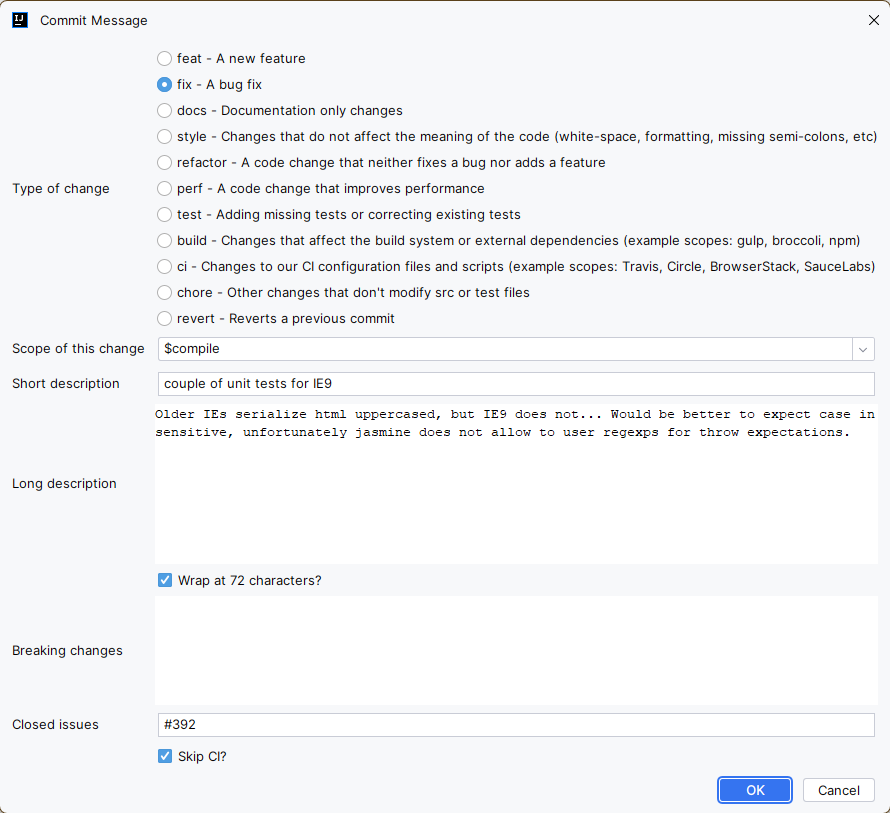
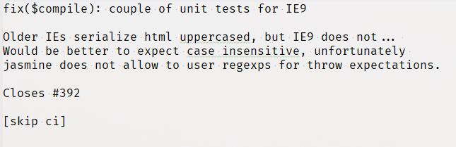

# Git commit template Plugin for IntelliJ

I really like using this submission template plug-in, but the original project has stopped being maintained, so I cloned
it and made modifications. Welcome to use it!
[Original project link](https://github.com/MobileTribe/commit-template-idea-plugin.git)

This plugin allows to create a commit message with the following template:

```
<type>(<scope>): <subject>
<BLANK LINE>
<body>
<BLANK LINE>
<footer>
```

From the contribution guidelines of the Angular
project [here](https://github.com/angular/angular.js/blob/master/CONTRIBUTING.md#commit-message-format).

## Installation

Install directly from the IDE plugin manager (File > Settings > Plugins > Browser repositories > Git Commit Template)

## Usage





## License

Licensed under the Apache License, Version 2.0 (the "License");
you may not use this file except in compliance with the License.
You may obtain a copy of the License at

http://www.apache.org/licenses/LICENSE-2.0

Unless required by applicable law or agreed to in writing, software
distributed under the License is distributed on an "AS IS" BASIS,
WITHOUT WARRANTIES OR CONDITIONS OF ANY KIND, either express or implied.
See the License for the specific language governing permissions and
limitations under the License.
