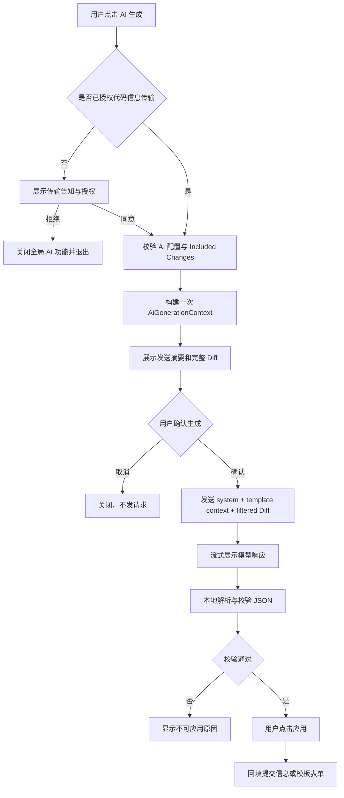

# AI 生成 Git 提交信息：精简设计

## 1. 目标与边界

目标：基于当前 Commit 窗口中**已勾选**文件的 Git Diff，调用用户配置的 AI 模型，生成一条符合当前提交模板规则的提交信息建议。

AI 仅负责生成建议。插件必须始终保证：

- 不执行 `git commit`、`git push`、暂存或代码修改；
- 不自动写入或自动确认提交；
- 用户手动点击“应用到提交信息/表单”后才回填；
- API Key 仅存储于 IntelliJ Password Safe，不进入请求预览、日志、项目文件或配置 XML；
- 只使用 Commit UI 当前 Included Changes，绝不扫描整个工作区。

## 2. 首次使用：代码信息传输告知与授权

首次点击任一 AI 入口时，若尚未记录用户授权状态，必须先弹出不可跳过的确认对话框，**在用户确认前不得构建 Diff、读取文件内容或发起网络请求**。

对话框必须清晰说明：

- AI 功能会将当前 Commit UI 中已勾选文件的、经过本地筛选后的 **Git Diff（可能包含代码与文本内容）** 发送至用户配置的远程 AI 服务；
- 插件不会发送未勾选文件，不会扫描整个工作区；但用户仍应在发送前检查将要传输的 Diff；
- 插件会排除二进制、内置敏感文件和用户排除规则匹配的文件，但自动规则无法保证识别所有敏感信息；
- 建议在 AI 模型设置中配置排除规则，例如私钥、凭据、令牌、环境变量、客户数据、生成文件和其他不应离开本机的文件；
- 该操作只是将代码信息发送给 AI 服务生成提交信息建议，**不会执行 Git 提交、推送、暂存或修改代码**；
- AI 服务的隐私政策、数据保留和跨境传输由用户选择的服务商决定，用户应自行确认合规性。

提供两个明确操作：

- `同意并继续`：持久化记录 `ACCEPTED`，继续本次 AI 流程；
- `拒绝并关闭 AI`：持久化记录 `DECLINED`，立即将全局 AI 能力设为关闭，关闭当前弹窗，不构建 Diff、不请求网络。

不提供“以后再说”或默认同意。已记录为 `DECLINED` 时，AI 入口保持隐藏；用户只能在 AI 模型设置页重新显式开启 AI 功能后再次触发授权确认。授权状态仅保存用户选择，不能保存 API Key、Diff 或请求内容。

建议全局状态字段：

```text
AiDataTransferConsent = UNDECIDED | ACCEPTED | DECLINED
```

## 3. 前置校验

用户已授权后，点击“AI 生成”按以下顺序校验，任一步失败立即提示并停止，不发起网络请求：

1. AI 能力已启用；
2. `AiDataTransferConsent` 为 `ACCEPTED`；
3. 已配置 Endpoint、Model、System Prompt；
4. 当前 Endpoint 已在 Password Safe 配置 API Key；
5. 当前 Commit UI 存在 Included Changes；
6. 筛选后至少存在一个可发送的文本 Diff。

## 4. 唯一数据来源

只构建一次 `AiGenerationContext`，后续 UI 预览、请求构造和本地校验均使用它，避免“预览内容”和“实际发送内容”不一致。

```text
AiGenerationContext
├── endpoint / apiPath / model / temperature / maxTokens
├── renderedSystemPrompt       # 用户系统提示词替换运行时占位符后的结果
├── commitTemplateContext      # 当前项目生效的提交模板规则
├── includedChangesMetadata    # 仅用于界面摘要，不发送给模型作为独立内容
├── filteredDiff               # 经过筛选、限量后的最终 Diff
└── diffSummary                # 文件数、字符数、截断与排除原因
```

### Diff 筛选规则

在内存中按 Included Changes 构建 unified diff，并且：

- 使用相对项目路径；
- 排除二进制文件；
- 排除内置敏感文件（`.env`、密钥、凭据、token 等）；
- 应用用户定义的排除规则；
- 限制总字符数；
- 不落盘、不记录日志。

如果达到限制，保留已加入的 Diff，并在 UI 中说明截断；如果最终 Diff 为空，停止请求。

## 5. 请求模型：固定两条消息

不再提供“仅元数据 / 发送 Diff”的模式切换。一次生成只有一个明确的请求：**系统提示词 + 模板上下文 + 已筛选 Diff**。

```json
{
  "model": "<model>",
  "stream": true,
  "temperature": "<temperature>",
  "max_tokens": "<maxTokens>",
  "messages": [
    {
      "role": "system",
      "content": "<renderedSystemPrompt>"
    },
    {
      "role": "user",
      "content": "当前提交模板规则：\n<commitTemplateContext>\n\n待提交的已筛选 Diff：\n<filteredDiff>"
    }
  ]
}
```

### 系统提示词职责

系统提示词由用户配置，插件仅替换以下占位符：

```text
{languageLabel}
{languageKey}
{allowedTypes}
{subjectMaxLength}
```

默认提示词应明确要求模型：

- 只返回约定 JSON；
- `type` 只能取 `{allowedTypes}`；
- 遵守 `{subjectMaxLength}`；
- `scope`、`subject`、`body`、`breakingChange` 等用户可见的提交内容，必须使用当前 Git 模板的提交内容语言 `{languageLabel}`（语言键：`{languageKey}`）；
- 不得使用 IDE/UI 显示语言、模型默认语言或 Diff 中自然语言来决定输出语言；仅当字段是代码标识符、专有名词或约定的英文技术术语时，才保留其原始写法；
- 不根据路径或文件名臆测功能、Issue、破坏性变更；
- 信息不足时保守生成；
- 禁止解释、Markdown 和思维过程。

### 模板上下文职责

`commitTemplateContext` 不传 UI 表单原始状态，而传本地最终生效规则：

```text
提交内容语言：<language>
允许的提交类型：<types>
标题最大长度：<max>
是否启用 scope：<true/false>
是否允许 body：<true/false>
是否允许 breaking change：<true/false>
Issue/footer 规则：<rules>
Gitmoji：由本地格式化器决定，AI 不生成
```

这样模型能够理解约束，但最终格式（Gitmoji、footer、换行）仍完全由本地 formatter 控制。

## 6. 简化后的 UI 流程



弹窗只保留以下操作：

- `生成`：首次展示 Diff 后变为 `确认并生成`；
- `应用到提交信息` 或 `应用到表单`：仅在本地校验通过后可用；
- `关闭`。

“发送 Diff”复选框、元数据模式、开发专用的额外提示词展示开关均移除。开发调试如有需要，改为仅在 Internal Mode 下以只读折叠面板展示完整请求消息，不能进入正式发布 UI。

## 7. 本地响应校验与回填

模型返回固定 JSON：

```json
{
  "type": "feat",
  "scope": "optional-scope",
  "subject": "short description",
  "body": "optional detail",
  "breakingChange": "optional breaking change",
  "issueNumbers": [123]
}
```

插件在应用前必须：

1. 解析 JSON；
2. 校验 `type` 位于当前允许类型中；
3. 校验用户可见提交内容与当前 Git 模板的提交内容语言一致；无法可靠判断时不因语言检测误拒绝，但必须以系统提示词约束为准；
4. 使用既有 `CommitMessageValidator` 校验标题、scope、body、breaking change 和 issue；
5. 使用既有 `CommitMessageFormatter` 生成最终提交文本；
6. 仅在用户点击“应用”后回填目标控件。

## 8. 实施步骤

1. 在 `AiPreferencesState` 增加全局 `AiDataTransferConsent` 状态；保持 API Key 仍仅存于 Password Safe；
2. 新增独立的 `AiDataTransferConsentDialog`，所有 AI 入口共用；拒绝时将 `enabled` 设为 `false` 并持久化 `DECLINED`；
3. 在 `AiQuickGenerateAction` 和模板弹窗入口中，先经过授权守卫，再采集任何变更；
4. 新增或重构 `AiGenerationContext`，替代散落的 `request + diff + summary` 临时变量；
5. 将 `AiIncludedChangesCollector` 改为一次返回 `DiffCollectionResult`，不再保留 metadata-only 请求入口；
6. 新增 `AiCommitTemplateContextRenderer`，把 `EffectiveCommitTemplateSettings` 转为稳定的文本上下文；
7. 重构 `AiPromptRenderer`：用户消息固定为“模板上下文 + 已筛选 Diff”；
8. 精简 `AiGenerationDialog`：移除 Diff 勾选框和元数据分支，构建后展示摘要，用户确认后请求；
9. 保留 `OpenAiCompatibleProvider` 的 OpenAI Compatible SSE 实现、取消能力和脱敏原则；
10. 保留 `AiSuggestionParser`、`AiSuggestionValidator`、表单回填与提交信息回填；
11. 删除正式代码中的 `DEVELOPMENT_DIFF_PREVIEW` 和相关 i18n 文案；开发请求检查仅保留 Internal Mode 的只读折叠面板；
12. 为授权接受/拒绝、context 构建、Diff 过滤、提示词渲染、提交内容语言约束和本地校验补充单元测试；
13. 在 IDE Sandbox 手工验证：首次同意、首次拒绝、重新开启后的重新授权、中文/英文等不同 Git 模板语言、空变更、敏感文件、截断 Diff、SSE 取消、非法 JSON、工具栏回填、模板弹窗回填。

## 9. 对现有实现的取舍

保留：Password Safe、Included Changes 获取、敏感 Diff 过滤、OpenAI Compatible SSE、流式输出、本地 JSON 校验、本地 formatter、两种回填目标。

删除或合并：`METADATA` 传输模式、Diff 发送复选框、请求时重复构建 Diff、正式发布中的开发预览逻辑，以及仅为两条请求路径存在的 UI/提示词分支。
