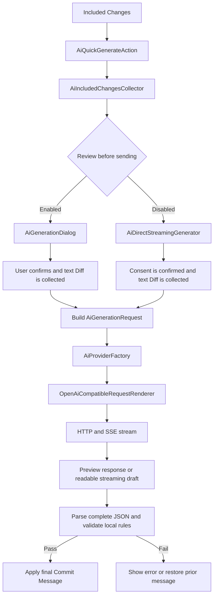

# Git Commit Template Plugin Documentation

> This document serves two audiences:
>
> - **Plugin users**: installation, configuration, usage, privacy, and troubleshooting.
> - **Project developers**: architecture, local development, validation, and AI Provider extension.

## 1. Overview

Git Commit Template is an IntelliJ IDEA plugin for creating, formatting, and validating structured Git commit messages. It also provides AI-generated commit-message suggestions from the changes selected in IDEA's **Included Changes** list.

The project is maintained and extended from `MobileTribe/commit-template-idea-plugin`. Its plugin ID is `commit-template-plugin` and its display name is **Git Commit Template**.

### 1.1 Key capabilities

- Creates structured Conventional Commits-style messages in the IDEA Commit tool window.
- Applies configurable local validation rules before a commit message is accepted.
- Supports global defaults and per-project template overrides.
- Generates AI commit-message suggestions from selected changes only.
- Supports Qwen, ChatGPT/OpenAI, DeepSeek, and custom OpenAI-Compatible services.
- Stores API keys in IntelliJ Password Safe rather than ordinary plugin settings.
- Provides request review, streaming suggestions, local output validation, and privacy filters.

### 1.2 Commit-message format

```text
<type>(<scope>): <subject>

<body>

<footer>
```

`scope` can be configured as optional. For example:

```text
feat(config): add Qwen generation options

- Support sampling and thinking-mode settings
- Include provider-specific parameters in AI requests

Refs: #123
```

### 1.3 Runtime and development baseline

| Item | Current configuration |
| --- | --- |
| IntelliJ Platform | IntelliJ IDEA Community (`IC`) 2023.3 |
| Minimum build | `233` |
| Java | JDK 17 |
| Gradle Wrapper | Gradle 8.13 |
| IntelliJ Gradle Plugin | `org.jetbrains.intellij` 1.17.4 |
| Git dependency | `Git4Idea` |
| Plugin version | See `pluginVersion` in `gradle.properties` |

Compatibility should always be verified in a Sandbox based on the target IDE version before release.

---

# Part I: Plugin users

## 2. Installation and entry points

### 2.1 Install the plugin

1. Open **Settings / Preferences → Plugins** in IntelliJ IDEA.
2. Search Marketplace for **Git Commit Template** and install it. Alternatively, install a locally built plugin ZIP from disk.
3. Restart IDEA if prompted.

Project links:

- Repository: <https://github.com/muzilib/commit-template-idea-plugin>
- Issue tracker: <https://github.com/muzilib/commit-template-idea-plugin/issues>

### 2.2 Open settings

Open:

```text
Settings / Preferences → Tools → Commit Template Idea Plugin
```

The settings page contains the following tabs:

| Tab | Purpose |
| --- | --- |
| Commit Template | Configure global template defaults |
| Project Overrides | Override template settings for the current project |
| Commit Rules | Configure commit-message validation rules |
| Preferences | Configure UI language and other plugin preferences |
| AI Model | Configure AI commit suggestions |
| About | Show plugin information |

### 2.3 Commit-window actions

In IDEA's Git Commit tool window, use:

- **Create commit template** to open the structured Commit Message editor.
- **AI Generate Commit Message** to create a suggestion from selected Included Changes.
- `Alt + Shift + Q` to open the template panel by default. Actual availability depends on the operating system and configured keymap.

## 3. Commit templates and local rules

### 3.1 Fields

| Field | Purpose | Example |
| --- | --- | --- |
| `type` | Category of the change | `feat`, `fix`, `docs` |
| `scope` | Affected area; can be optional | `config`, `vcs` |
| `subject` | Concise summary | `add AI model settings` |
| `body` | Important implementation details | `- support Qwen options` |
| `footer` | Issue links or metadata | `Refs: #123` |
| Breaking Change | Incompatible-change description | `BREAKING CHANGE: ...` |

### 3.2 Recommended types

The types allowed by your configured rules are authoritative. Common conventions include `feat`, `fix`, `docs`, `style`, `refactor`, `perf`, `test`, `build`, `ci`, and `chore`.

For high-quality messages:

- Keep the subject short and action-oriented.
- Summarize multi-file work by capability in the body instead of listing paths.
- Use the footer consistently for work-item references.
- Keep the rule set small and stable when introducing the plugin to a team.

## 4. AI commit suggestions

### 4.1 Safety boundary

AI only generates a Commit Message suggestion. It does **not**:

- run `git commit`;
- push code;
- stage or unstage files;
- change project source code;
- replace human review.

Review and edit every generated message before you perform the normal IDEA commit operation.

### 4.2 Supported providers

| Provider | Recommended compatible API URL |
| --- | --- |
| Qwen | `https://dashscope.aliyuncs.com/compatible-mode/v1/chat/completions` |
| ChatGPT / OpenAI | `https://api.openai.com/v1/chat/completions` |
| DeepSeek | `https://api.deepseek.com/chat/completions` |
| Custom | A user-supplied OpenAI-Compatible Chat Completions URL |

The API URL remains editable. Enter a model name that is available to your account and works with the selected service.

### 4.3 Configure an AI service

Open **Settings / Preferences → Tools → Commit Template Idea Plugin → AI Model**, then:

1. Enable **AI commit suggestions**.
2. Select a provider.
3. Confirm or edit its API URL.
4. Enter the model name.
5. Set the API key.
6. Open **Advanced settings** if you need Temperature, output-token, system-prompt, or provider-specific settings.
7. Select **Apply** or **OK**.

API keys are stored through IntelliJ Platform **Password Safe**, not in normal plugin configuration files. Each provider (Qwen, ChatGPT, DeepSeek, and Custom) has one independent key; changing the API URL or model within a provider continues to use that provider's key.

### 4.4 System prompts

The plugin includes independent default system prompts for Qwen, ChatGPT, DeepSeek, and custom services. They instruct the model to return structured JSON that can be validated locally.

A custom prompt configured for the active provider has higher priority:

```text
Custom prompt for the active provider
> Built-in prompt for the active provider
```

If an old saved custom prompt does not include recent default improvements, restore the current provider default prompt in the AI settings and apply the configuration.

### 4.5 Generate a suggestion

1. Open the IDEA **Commit** tool window.
2. Select the files for this commit under **Included Changes**.
3. Click **AI Generate Commit Message**.
4. Complete the flow configured by **Review before sending**.
5. Review and optionally edit the generated result.
6. Commit through IDEA as usual.

#### Review before sending enabled

```text
Collect and filter Included Changes
→ show a complete request preview
→ user confirms sending
→ stream the AI response
→ parse complete JSON and validate local rules
→ user applies the result to Commit Message
```

The preview includes the target URL, redacted headers, request JSON, final system prompt, template context, filtered Diff, and filtering statistics. Authorization is never shown in plain text.

#### Review before sending disabled

```text
Collect and filter Included Changes
→ send a streaming request directly
→ progressively fill a readable Commit Message draft
→ parse complete JSON and validate local rules after streaming ends
```

The progressive text is only a visual draft. Final strict JSON parsing and local-rule validation happen once the stream completes:

- On success, the final formatted Commit Message is kept.
- For invalid JSON, rule failures, network errors, or cancellation, the previous Commit Message is restored and a notification is shown.

## 5. Privacy and data transfer

### 5.1 What is sent

Only changes currently selected in IDEA's **Included Changes** are considered. The plugin does not automatically upload every uncommitted file in the project.

Before building a Diff, the plugin:

- excludes binary files;
- excludes built-in sensitive paths and file names such as `.env`, key files, `credential`, `secret`, `password`, and `token`;
- applies user-defined exclusion patterns;
- sends project-relative paths only, not local absolute paths;
- processes at most 100 file metadata entries;
- limits the combined Diff to 80,000 characters;
- builds the Diff in memory only and does not write it to disk.

If no eligible text Diff remains, the plugin stops before network access and shows a notification.

### 5.2 Consent and provider responsibility

The first real Diff transfer requires explicit consent, even when request review is disabled. Before consenting, understand the selected provider's retention, pricing, network, regional, and privacy policies. Those policies are controlled by the service provider, not by this plugin.

### 5.3 Exclusion patterns

Maintain exclusion patterns in the AI settings for secrets, certificates, production configuration, customer data, generated artifacts, or any content that must not be sent externally. Built-in filtering is only a baseline and does not replace your organization's data-security policy.

## 6. Qwen-specific settings

When Qwen is selected, advanced settings expose Qwen-specific options. Empty optional numeric values are omitted so that the server uses its defaults.

| Category | Options |
| --- | --- |
| Streaming usage | `stream_options.include_usage` |
| Sampling | `top_p`, `top_k` |
| Penalties | `repetition_penalty`, `presence_penalty` |
| Reproducibility | `seed` |
| Thinking | `enable_thinking`, `thinking_budget`, `reasoning_effort` |
| Search | `enable_search`, `forced_search`, `search_strategy` |
| Data inspection | `X-DashScope-DataInspection` |

`thinking_budget` and `reasoning_effort` cannot be used together. The plugin explicitly sends `enable_thinking: false` by default to reduce the chance that a thinking model consumes a small output budget entirely on reasoning content. If no visible text is returned while thinking is enabled, disable thinking or increase the maximum output tokens.

## 7. Troubleshooting

### AI action is unavailable

Verify that the plugin is enabled, the project uses Git, the Commit tool window is open, and **AI commit suggestions** is enabled in settings.

### No eligible changes can be sent

No files may be selected, the files may be binary, or they may match built-in sensitive filtering or user exclusion rules. Confirm the selected text changes and review the exclusion patterns.

### Authentication fails after setting an API key

Verify the key configured for the active provider, the full API URL including `/chat/completions`, provider access, model permission, network/proxy access, and provider quota.

### AI output cannot be applied

The output must be complete JSON and satisfy local commit rules. Restore the provider default prompt, lower Temperature, increase output tokens, or review overly strict local rules.

### Qwen returns no visible response

Thinking content can consume the output-token budget. Disable thinking or increase the maximum output tokens.

---

# Part II: Project developers

## 8. Architecture and source layout

### 8.1 Stack

The plugin uses Java 17 and the IntelliJ Platform Gradle Plugin. Key dependencies are IntelliJ Platform SDK, Git4Idea, Jackson Databind, Apache HttpClient, Lombok, and JUnit Jupiter.

### 8.2 Directory layout

```text
src/main/java/com/c301/plugin/
├── application/       # Application-level orchestration
├── config/            # Settings, actions, persistent state, rule resolution
├── constant/          # Constants
├── domain/            # AI and commit-message models, rules, interfaces
├── infrastructure/    # Providers, request rendering, credentials, path matching
├── model/             # Existing business data models
├── platform/          # IntelliJ Platform and VCS adapters
├── ui/                # Dialogs, streaming drafts, notifications
└── utils/             # Utilities and i18n helpers

src/main/resources/
├── META-INF/plugin.xml
├── i18n/
├── icons/
├── ai-system-prompt.toml
└── version.properties
```

### 8.3 Plugin registration

`src/main/resources/META-INF/plugin.xml` registers plugin metadata, compatibility, dependencies, services, settings pages, the Gitmoji VCS Log column, and Commit-window actions. Confirm target-platform API compatibility before registering a new action, service, or extension point.

### 8.4 Core modules

| Area | Key classes/files | Responsibility |
| --- | --- | --- |
| Unified settings | `UnifiedCommitTemplateSettingsConfigurable` | Combines global template, project override, rules, preferences, AI, and About tabs |
| Commit templates | `CreateCommitAction`, `CommitTemplateDialog` | Opens and fills structured commit messages |
| Commit rules | `CommitMessageRulesConfigurable`, `domain/commit` | Configures and validates Commit Messages |
| AI preferences | `AiPreferencesState`, `AiPreferencesConfigurable` | Stores non-sensitive AI settings and renders the settings UI |
| Providers | `AiProvider`, `AiProviderFactory`, `*AiProvider` | Builds provider-specific OpenAI-Compatible requests and consumes streams |
| Request rendering | `OpenAiCompatibleRequestRenderer` | Produces the shared preview and real request payload |
| Credentials | `PasswordSafeAiCredentialStore` | Saves API keys through Password Safe |
| Diff collection | `AiIncludedChangesCollector` | Reads Included Changes and applies path, binary, and size filtering |
| AI UI | `AiGenerationDialog`, `AiDirectStreamingGenerator` | Orchestrates review mode and direct streaming mode |
| Streaming drafts | `IncrementalSuggestionDraft` | Renders recognized fragments of incomplete JSON as readable drafts |
| Default prompts | `ai-system-prompt.toml`, `AiSystemPromptTemplates` | Loads common and provider-specific system prompts |

## 9. AI request lifecycle

### 9.1 Request model

`AiGenerationRequest` represents data approved by local security policy for a Provider request: API URL, model, final prompt, generation settings, Qwen options, language, allowed types, commit rules, template context, and sanitized Diff. API keys are intentionally excluded from this model and must not be persisted or logged.

### 9.2 Flow



### 9.3 Request consistency

The preview and actual HTTP request must share `OpenAiCompatibleRequestRenderer`; the active Provider then appends provider-specific payload fields or headers through:

```java
default void customizeRequestPayload(Map<String, Object> payload, AiGenerationRequest request)
default void customizeRequestHeaders(HttpPost post, AiGenerationRequest request)
```

For example, Qwen replaces generic `max_tokens` with `max_completion_tokens` and adds its own thinking, search, streaming-usage, or data-inspection settings. Do not implement a request field in only the preview or only the network path.

### 9.4 Output contract

The default prompt requires six JSON fields: `type`, `scope`, `subject`, `body`, `breakingChange`, and `footer`. Streaming UI may display recognized partial fields as a draft, but `AiSuggestionParser` and the local rule validator must strictly parse and validate the complete response after the stream ends.

## 10. Local development and Sandbox

### 10.1 Setup

1. Install JDK 17.
2. Open the repository root in IntelliJ IDEA.
3. Import the Gradle project from `build.gradle` and `gradle.properties`.
4. Set both Project SDK and Gradle JVM to JDK 17.
5. Wait for indexing, dependency resolution, and IntelliJ Platform SDK initialization.

The configured target is `IC-2023.3` with `Git4Idea`. If the platform version changes, verify `plugin.xml` compatibility declarations and all used IntelliJ APIs.

### 10.2 Run in Sandbox

Use the IntelliJ Gradle Plugin's `runIde` task, or an equivalent IDE run configuration, to start a Sandbox IDEA. Open a Git repository inside the Sandbox and verify the Commit-window integration. Sandbox settings, caches, and Password Safe entries may be separate from the daily IDE, so configure test AI credentials there using a controlled test repository.

### 10.3 Gradle tasks

| Task | Purpose |
| --- | --- |
| `runIde` | Start a Sandbox IDEA with the plugin |
| `test` | Run JUnit tests |
| `buildPlugin` | Produce an installable plugin ZIP |
| `buildStable` | Clean and build a Stable-channel package |
| `buildAlpha` | Clean and build an Alpha-channel package |

### 10.4 Debugging guidance

- Prefer breakpoints and reproduction in Sandbox for actions, settings, and Provider flows.
- For network failures, inspect status codes and redacted SSE event structure. Never log API keys or sensitive full Diffs.
- For Commit UI integration, verify that the `DataContext` supplies `CommitMessageI` and the commit workflow handler.
- Marshal streaming UI updates back to the Swing event thread, for example with `invokeLater`.

## 11. Development workflow and constraints

### 11.1 Workflow

```text
Define requirements and safety boundary
→ locate the existing module and call chain
→ design the smallest viable change
→ implement domain, infrastructure, and UI changes
→ update i18n, prompts, and documentation
→ run focused checks and tests
→ manually verify in Sandbox
→ review the diff and commit
```

### 11.2 Engineering rules

- Fix root causes and keep changes focused.
- Never store API keys in ordinary persistent state, logs, or exception text.
- Do not write raw sensitive Diffs to disk.
- AI may suggest messages only; it must not commit, push, stage, or change source code.
- Add every new user-visible string to all supported i18n bundles.
- Validate preview and actual request behavior together whenever request rendering changes.

### 11.3 GUI Designer restriction

Do not manually modify these GUI Designer-generated methods:

```java
CommitTemplateDialog.$$$setupUI$$$()
CommitTemplateSettingUI.$$$setupUI$$$()
```

Extend existing forms with runtime Swing composition instead, keeping `.form` files and generated code consistent.

### 11.4 Internationalization

Resources live under `src/main/resources/i18n/`. When adding a key, update the default `data.properties` and every locale file. Use `\n` for multiline property values rather than physical line breaks. Verify settings, dialogs, and notifications after language switching.

### 11.5 Validation

Validate from narrow to broad scope:

1. Inspect changed Java files with IDEA Diagnostics.
2. Run:

   ```sh
   git diff --check
   ```

3. Verify i18n key completeness after resource changes.
4. Manually test Commit UI or AI networking in Sandbox.
5. When available, run unit tests, build the plugin, and test against the target IDEA version.

Do not reset, overwrite, or delete unrelated uncommitted work just to make checks pass.

## 12. Add a new AI Provider

Keep the OpenAI-Compatible layering: reuse common HTTP/SSE transport and isolate service differences in the Provider implementation.

1. Add a provider entry to `AiProviderType` with default URL, prompt-template name, and model-placeholder key.
2. Add a Provider implementation, reusing `OpenAiCompatibleProvider` where appropriate.
3. Register it in `AiProviderFactory`.
4. Add provider UI, preset behavior, and non-sensitive state in AI preferences.
5. Keep API keys in `AiCredentialStore` / Password Safe.
6. Implement special payload fields or headers with the Provider customization hooks.
7. Add the default prompt to `ai-system-prompt.toml` and verify it can be loaded.
8. Add all localized strings.
9. Verify preview and actual requests produce matching payloads and headers.
10. Test authentication, streaming, malformed responses, cancellation, and local-rule failures in Sandbox.

Checklist:

- [ ] API URL is editable and preset switching is correct.
- [ ] API keys are isolated by provider and are never shared with another provider.
- [ ] No network request is made without an eligible Diff.
- [ ] Provider-specific fields do not leak to other providers.
- [ ] SSE parsing matches the service response format.
- [ ] Final output still passes shared JSON parsing and local rule validation.
- [ ] Errors, cancellation, and validation failures preserve the previous Commit Message.

## 13. Release and maintenance

Before release:

- verify plugin metadata, compatibility range, dependencies, and `pluginVersion`;
- start a Sandbox for the target IDEA version and verify core commit flows;
- run tests and build an installable ZIP in an appropriate environment;
- review license, README, change notes, and both documentation languages;
- make sure artifacts, logs, and screenshots contain no API keys or sensitive Diff content.

Recommended regression coverage includes template formatting, project overrides, empty Included Changes, binary/sensitive-file filtering, reviewed and direct AI flows, malformed JSON, rule violations, Qwen thinking disabled, and localized UI strings.

## 14. License and feedback

The project is licensed under Apache License 2.0; see `LICENSE` in the repository root. When reporting an issue, provide IDEA and plugin versions, operating system, reproducible steps, and redacted error details. Do not include API keys or sensitive Diffs.