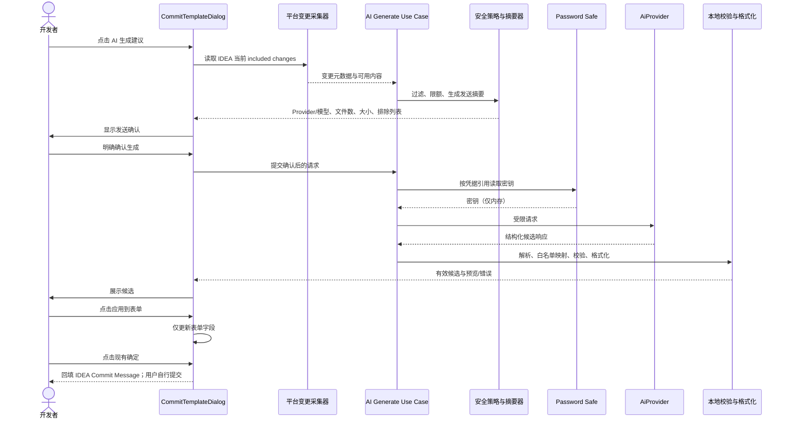

# AI Commit Assistant：业务方案与执行流程（待确认）

> 状态：**方案确认稿，尚未实现**。  
> 本文确认后，才开始配置骨架、Password Safe 接入和 Provider 抽象开发；在此之前不发送网络请求、不注册 AI Action。

## 1. 目标、非目标与核心原则

### 1.1 目标

在 IntelliJ Commit 工作流中，基于用户选择的待提交变更生成 Conventional Commit 的**候选建议**，帮助填写：提交类型、Scope、标题、正文、Breaking Change 与 Issue footer。

### 1.2 非目标

- 不自动执行 `git commit`、`git push` 或暂存操作；
- 不修改代码、Diff、工作区或已选提交文件；
- 不在后台自动发送变更给任何 AI 服务；
- 不替代本地规则校验和格式化；
- 第一阶段不支持对话式代码问答、代码修改、Agent 自治执行。

### 1.3 不可变安全原则

1. **显式触发**：只有用户点击“AI 生成”后才允许开始流程。
2. **最小披露**：默认仅发送变更元数据；发送 Diff 需用户额外同意。
3. **可见可控**：发送前展示目标 Provider、模型、内容范围、文件数和大小；用户可取消。
4. **人类确认**：候选仅显示在预览区，用户点击“应用到表单”后才填入提交字段。
5. **本地兜底**：候选必须经本地 schema 解析、提交规则校验和 `CommitMessageFormatter` 格式化。
6. **凭据隔离**：仅 IntelliJ Password Safe 保存密钥；项目文件、XML state、日志和通知均不得出现密钥。

## 2. 用户体验方案

### 2.1 设置页：偏好设置 → AI（第一阶段）

在现有“偏好设置”中新增 AI 分区。建议字段如下：

| 字段 | 作用域 | 默认值 | 说明 |
| --- | --- | --- | --- |
| 启用 AI 建议 | 全局 | 关闭 | 关闭时 Commit Dialog 不显示 AI 入口 |
| Provider 类型 | 全局 | OpenAI-compatible | 首期支持 OpenAI-compatible 与 Ollama |
| Endpoint | 全局 | Provider 默认值 | 仅保存 URL，不保存认证信息；自定义地址需 HTTPS，Ollama 本地地址例外 |
| 模型 | 全局 | Provider 默认值 | 如 `gpt-4.1-mini`、`qwen...`、本地模型名 |
| 允许发送 Diff | 全局 | 关闭 | 明确控制是否可向 Provider 发送代码变更 |
| 最大文件数/总大小 | 全局 | 保守默认 | 防止意外上传大量内容；建议首期固定安全上限，不开放 UI 调整 |
| API Key | Password Safe | 空 | 仅 OpenAI-compatible 使用；页面只显示“已配置/未配置”，不回显明文 |

建议将非敏感 AI 配置单独放入全局 `AiPreferencesState`，而不是继续膨胀 `StoreCommitTemplateState`。配置字段不允许项目覆盖，保证团队项目文件中不出现 Provider、端点和隐私偏好。

### 2.2 Commit Dialog 中的交互

建议在现有提交模板对话框中增加“AI 建议”区域或按钮：

1. 用户选择 Git 已包含的变更文件；
2. 点击 **AI 生成建议**；
3. 首先出现“发送内容确认”面板；
4. 用户检查 Provider/模型、传输模式、文件列表、大小、排除项；
5. 用户明确点击 **生成**；
6. 插件后台请求 Provider；
7. 返回一个或多个候选，显示为结构化字段和最终格式化预览；
8. 用户可编辑候选；点击 **应用到表单** 才替换对应字段；
9. 用户照常点击现有“确定”回填 Commit Message，并自行在 IDEA 执行最终提交。

候选展示必须提供：

- “应用到表单”；
- “关闭/忽略”；
- “重新生成”（每次重新生成都复用或重新展示发送范围）；
- 请求中“取消”；
- 清晰显示是否发送了 Diff；
- 本地校验错误，不允许无效候选被一键应用为最终消息。

## 3. AI 端到端执行流程



## 4. 数据最小化与传输策略

### 4.1 两级传输模式

| 模式 | 默认 | 发送内容 | 适用情况 |
| --- | --- | --- | --- |
| 元数据模式 | 是 | 文件路径（可选择仅文件名）、变更类型、语言/扩展名、行数统计 | 希望快速获得粗略类型/标题建议，或禁止上传代码 |
| Diff 模式 | 否 | 经筛选、截断和确认后的 Unified Diff | 需要较准确的标题、正文及 Scope 建议 |

首期建议：默认元数据模式；只有用户在全局偏好中开启“允许发送 Diff”且在本次发送确认中勾选后，才允许 Diff 模式。

### 4.2 必须过滤和限制

请求构建时必须在本地执行下列策略：

- 仅使用 IDEA Commit UI 当前 `included changes`，不读取未勾选文件；
- 排除二进制、超大文件、生成物、依赖锁定文件和用户配置的排除路径；
- 默认排除显著敏感名称/扩展名，例如 `.env`、`*.pem`、`*.key`、`id_rsa`、`credentials*`、`secrets*`；
- 限制单文件 Diff、总 Diff、文件数、请求字符数；
- 对超限文件标记“已排除”，不静默截断后假装完整；
- 不保存 Diff、Prompt、响应原文到磁盘；
- 不记录 Authorization header、API Key、完整 Diff 或完整模型响应。

> 说明：文件名过滤只能降低误传风险，不能可靠识别所有秘密。发送确认是必需的最后防线。

### 4.3 网络策略

- OpenAI-compatible 默认要求 HTTPS；自定义 HTTP Endpoint 应显示高风险警告并要求额外确认。
- Ollama 仅在显式选择本地 Provider 时允许 `localhost` / loopback HTTP。
- 请求必须有连接、读取与总时长超时；可取消；默认不自动重试写入型请求。
- Provider、Endpoint 和模型应在确认面板中完整可见。

## 5. 领域模型与技术设计

### 5.1 推荐分层

```text
 domain/ai/
   AiGenerationRequest            纯请求模型（不含 API Key）
   AiCommitSuggestion             type/scope/subject/body/breaking/issues
   AiGenerationResult             成功、可恢复错误、取消、拒绝
   AiProvider                     Provider 抽象接口

 application/ai/
   GenerateCommitSuggestionUseCase
   PrepareAiGenerationUseCase     采集后过滤、限额、生成确认摘要

 platform/vcs/
   IncludedChangesCollector       从 IDEA 当前 Commit UI 读取已选变更
   ChangeSnapshot                 与 IntelliJ API 隔离的变更快照

 infrastructure/credentials/
   AiCredentialStore              IntelliJ Password Safe 适配器

 infrastructure/ai/
   OpenAiCompatibleProvider
   OllamaProvider
   PromptRenderer
   ProviderResponseParser
```

### 5.2 Provider 抽象

建议接口以**非流式、单请求单响应**开始，降低 UI 和错误处理复杂度：

```java
public interface AiProvider {
    AiGenerationResult generate(AiGenerationRequest request, AiCredentials credentials,
                                ProgressIndicator progressIndicator);
}
```

- `AiGenerationRequest` 只包含经过安全策略批准的内容、目标语言、允许的 commit types 和规则摘要；
- `AiCredentials` 仅存在内存中，不实现 `toString()`，不被日志序列化；
- `OpenAiCompatibleProvider` 负责 Provider-specific JSON/HTTP；
- `OllamaProvider` 使用同一领域请求/结果模型；
- UI、Action、`application` 均不感知具体 HTTP JSON 格式。

### 5.3 结构化响应契约

模型应返回严格 JSON，对应如下概念结构：

```json
{
  "type": "feat",
  "scope": "auth",
  "subject": "add password reset entry point",
  "body": ["Expose the reset flow from the sign-in page."],
  "breakingChange": null,
  "issueNumbers": [],
  "confidence": "medium"
}
```

处理规则：

1. 解析失败时显示“无法解析 AI 响应”，提供原始文本的安全、可复制查看区，但不自动回填。
2. `type` 必须在当前生效提交类型列表中；否则让用户选择，不能静默创建新类型。
3. subject、scope、body、issue 均通过本地白名单/格式校验。
4. 本地 `CommitMessageValidator` 负责最终有效性判断；`CommitMessageFormatter` 负责最终文本。
5. AI 不控制 Gitmoji、footer keyword、换行规则或最终字符串格式。

## 6. 密钥管理方案

### 6.1 Password Safe 规则

- 使用 IntelliJ Password Safe 保存 API Key；
- key 使用稳定的 service name 和由 Provider/Endpoint 标识推导的 account name；
- Settings UI 仅能设置、替换、清除和显示“已配置/未配置”；绝不回显明文；
- 检查连通性时临时从 Password Safe 读取，不复制到 state；
- 清除凭据需二次确认；清除后不影响非敏感 Provider 配置。

### 6.2 禁止事项

- 不在 `AiPreferencesState`、`StoreCommitTemplateState` 或 `.idea/commit-template.xml` 中保存 API Key；
- 不在 `LlmUtil` 类中定义 API Key、Endpoint 或模型常量；
- 不使用 `System.out.println`、日志或异常 message 输出密钥、Prompt、Diff 或完整响应。

## 7. 分阶段实施计划

### Phase 0：遗留代码处置（必须先做）

- 不启用或注册 `GitCommitAiWriteAction`；
- 删除/隔离其变更内容控制台输出；
- 将 `LlmUtil` 标记为弃用，禁止新代码依赖；
- 不复用 `GitFileUtil` 中不透明的筛选逻辑作为 AI 安全策略。

### Phase 1：仅配置与凭据（无网络、无 Action）

交付：

- `AiPreferencesState`（仅非敏感字段）；
- `AiCredentialStore`（Password Safe）；
- “偏好设置 → AI”分区；
- 配置验证、设置/清除密钥 UI；
- 单元测试：状态持久化不含密钥、credential store 交互的可替换接口。

验收：全局 settings XML 与 `.idea/commit-template.xml` 中不存在 API Key。

### Phase 2：安全请求准备（无真实 Provider）

交付：

- `IncludedChangesCollector`；
- 敏感路径过滤、二进制过滤、大小/数量限制；
- 发送确认摘要 Dialog/Panel；
- 可取消后台任务；
- 单元测试覆盖排除、限额、仅 included changes。

验收：用户未确认时，任何内容均不离开本机。

### Phase 3：Provider 与候选预览

交付：

- `AiProvider`、OpenAI-compatible Provider；
- 非流式结构化响应解析；
- 网络超时、错误分类、取消；
- Commit Dialog 内候选预览与“应用到表单”；
- 本地规则验证与格式化。

验收：模型永远不能直接改写 Commit Message；只有“应用到表单”会改变表单内容。

### Phase 4：Ollama 与增强能力

交付：

- Ollama Provider；
- 可选流式展示（不改变确认机制）；
- 可选项目级非敏感 Prompt profile，前提是需求明确且不含凭据；
- 遥测仅在用户明确同意后引入，且不包含代码或提交正文。

## 8. 待你确认的产品决策

请确认以下建议；确认后按 Phase 0 → Phase 1 开始实施：

| 决策项 | 建议方案 | 需要确认 |
| --- | --- | --- |
| 首期 Provider | OpenAI-compatible + Ollama | 是否同意首期同时支持两者，或仅先做 OpenAI-compatible？ |
| 默认传输 | 元数据模式；Diff 默认关闭 | 是否接受“每次发送 Diff 均二次确认”？ |
| AI 配置作用域 | 全局唯一，不允许项目覆盖 | 是否同意？ |
| 生成方式 | 非流式单候选/少量候选 | 是否先不做流式输出？ |
| 安全筛选 | 内置敏感文件排除 + 限额 + 可见摘要 | 是否需要增加组织自定义排除规则？ |
| 交互位置 | 现有 CommitTemplateDialog 中的 AI 建议区 | 是否接受，还是希望独立对话框？ |
| 语言 | 生成内容跟随“提交内容语言”，UI 跟随“插件 UI 语言” | 是否同意维持这两个语言维度独立？ |

## 9. 推荐确认结论

推荐采用：**OpenAI-compatible 优先、Ollama 同期接口预留（可在 Phase 4 完成实现）**；默认不传 Diff；AI 全局配置；非流式结构化候选；在现有提交模板对话框内预览与明确回填。

该方案在保证首期可用性的同时，将网络、凭据、隐私与最终提交权限严格保留在用户手中。
