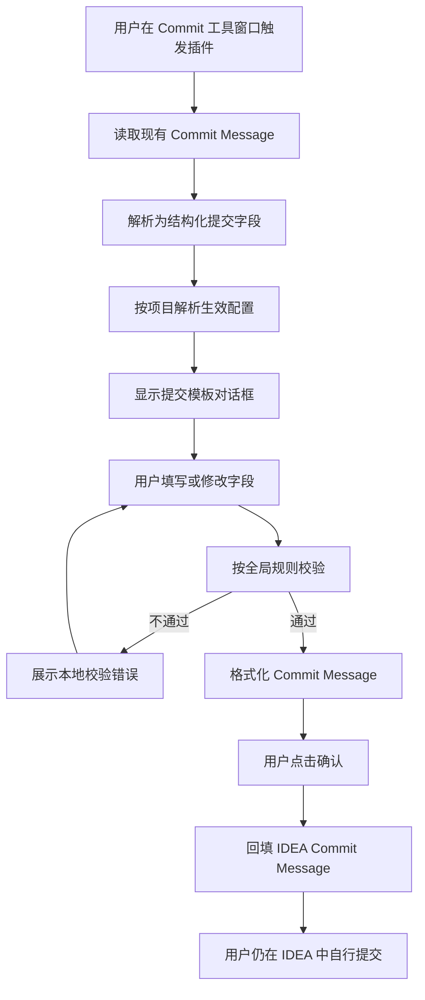

# Git Commit Assistant：业务方案与开发规范

> 状态：架构基线（2026-07-27）  
> 适用范围：`commit-template-idea-plugin` 的现有功能演进与后续 AI 能力开发。

## 1. 产品定位与不可突破的边界

本插件是 IntelliJ IDEA 中的 **Git Commit Message 编写助手**。它帮助用户将结构化信息生成、校验并回填到 IDEA 的 Commit Message 输入框。

### 核心价值

- 以 Conventional Commit 模板减少提交信息格式错误；
- 提供 Gitmoji、内置类型、多语言与自定义提交类型；
- 对提交信息进行实时预览、格式化与规则校验；
- 支持全局默认配置与项目级内容配置；
- 后续可基于用户明确授权的变更生成提交信息建议。

### 强制边界

1. 插件**不得自行执行** `git commit`、`git push`、暂存、修改工作区或修改已选文件。
2. 插件仅可通过 IntelliJ 的 `CommitMessageI#setCommitMessage` 回填用户已确认的提交信息。
3. AI 只能“生成建议 → 展示预览 → 用户明确回填”；不得自动覆盖原消息，不得自动提交。
4. API Key、Token、密码、Cookie 等凭据只能保存至 IntelliJ Password Safe，禁止写入全局 XML、`.idea/commit-template.xml`、日志、通知或异常文本。
5. 项目配置可被版本控制并在团队共享，因此不得存储任何敏感信息或本机隐私偏好。

## 2. 当前业务能力

### 2.1 提交信息结构

提交内容由下列字段组成：

```text
<type>(<scope>): <subject>

<body>

BREAKING CHANGE: <breaking-change>

<issue-footer-keyword> #<issue-number>

[skip ci]
```

其中 `scope`、`body`、breaking change、issue footer 与 `[skip ci]` 根据用户输入及规则按需出现。Gitmoji 是展示/格式化选项，而非独立提交字段。

### 2.2 设置导航

统一设置入口的顶层 Tab 固定为：

```text
提交模板 | 当前项目覆盖 | 提交规则 | 偏好设置 | 关于
```

| 页面 | 配置作用域 | 职责 |
| --- | --- | --- |
| 提交模板 | 全局默认 | 提交内容语言、是否启用自定义模板、全局自定义提交类型 |
| 当前项目覆盖 | 当前项目 | 覆盖提交内容语言、自定义模板开关与自定义提交类型列表 |
| 提交规则 | 全局唯一 | 类型/Scope 必填、标题最大长度、正文换行、Issue footer 关键字、禁止标题句点 |
| 偏好设置 | 全局唯一 | 预览显示、Gitmoji 开关及位置、插件 UI 语言 |
| 关于 | 只读 | 插件说明与版本信息 |

### 2.3 双语言模型

必须区分两种语言，不可互相替代：

| 概念 | 字段/来源 | 影响范围 |
| --- | --- | --- |
| 提交内容语言 | `StoreCommitTemplateState.language`，可被项目覆盖 | 内置提交类型的说明/内容语义 |
| 插件 UI 语言 | `StoreCommitTemplateState.uiLanguage` | 设置页、对话框、按钮等插件界面文案 |

UI 语言开启“同步 IntelliJ IDEA”时，必须通过 `DynamicBundle.getLocale()` 解析 IDEA 当前界面语言，不能使用 `Locale.getDefault()`。

## 3. 配置业务规则

### 3.1 存储与优先级

```text
项目可覆盖字段：项目覆盖值 > 全局默认值 > 内置默认值
全局唯一字段：全局值 > 内置默认值
```

| 状态 | 存储位置 | 可存储内容 |
| --- | --- | --- |
| `StoreCommitTemplateState` | `$APP_CONFIG$/StoreCommitTemplateState-settings.xml` | 全局默认、提交规则、UI 语言、展示偏好、窗口信息 |
| `ProjectCommitTemplateOverrideState` | `.idea/commit-template.xml` | 内容语言、自定义模板启用状态、提交类型列表的项目覆盖 |
| Password Safe（规划） | IDEA 安全存储 | AI Provider 凭据 |

`CommitTemplateSettingsResolver` 是带 `Project` 上下文时解析生效提交设置的唯一入口。调用方不得自行拼接全局和项目状态。

### 3.2 全局唯一字段

以下字段在所有项目中保持一致，项目覆盖页不得展示、更改或持久化：

- 提交规则；
- 插件 UI 语言；
- 提交信息预览开关；
- Gitmoji 启用状态与展示位置；
- 后续 AI 的凭据与本机安全/隐私偏好。

### 3.3 项目可覆盖字段

以下字段允许项目级配置；`null` 表示继承全局值：

- 提交内容语言；
- 自定义提交模板是否启用；
- 自定义提交类型列表，以及“该列表是否已在项目内显式配置”的标记。

## 4. 提交信息执行流程



详细流程见 [`execution-flow.md`](execution-flow.md)。

## 5. 技术分层与依赖规范

目标目录职责如下：

```text
ui/              Swing、Dialog、Settings 组件；只处理交互与展示
config/          PersistentState、Configurable、生效配置解析
 domain/         纯 Java 规则、格式化、解析、AI 请求/响应模型
application/     用例编排：生成、校验、回填前的业务流程
platform/        IntelliJ VCS、后台任务、通知、变更采集适配
infrastructure/  HTTP、Password Safe、AI Provider 与 Prompt 渲染
```

> 注：`domain/` 前缀前不应出现空格；上图为目录展示。

### 5.1 依赖方向

```text
ui/config/platform/infrastructure → application → domain
ui/config/platform/infrastructure → domain（仅允许使用纯模型/规则）
```

约束：

- `domain` 不依赖 IntelliJ SDK、HTTP 客户端、持久化框架或 Provider SDK；
- 只有 `platform` 可以直接使用 IntelliJ VCS/Git API；
- 只有 `infrastructure` 可以知道 OpenAI、Ollama 或其他厂商 HTTP 协议；
- `application` 依赖抽象接口，不依赖某个具体 Provider；
- UI 不直接发 HTTP，不直接读取/写入 Password Safe，不直接构造 Diff；
- 所有影响 Commit Message 的格式化必须复用领域规则，不能由 UI 或模型自行拼接。

## 6. 开发规范

### 6.1 代码与兼容性

- 运行基线为 IntelliJ IDEA `2023.3`（since-build `233`）、Java 17。
- 保持已有 XML state 名称与字段兼容；移除或重命名持久化字段必须提供迁移策略。
- 旧字段 `syncUiLanguageWithOs` 仅用于兼容历史 XML；新代码只能使用 `isSyncUiLanguageWithIde()` 与 `setSyncUiLanguageWithIde(...)`。
- 不要手改 GUI Designer 生成的 `$$$setupUI$$$()`；如需隐藏旧组件，应在构造器或手写容器层处理。
- 业务逻辑应使用显式类型和小型对象；避免在 Action、Dialog 或 `utils` 中继续累积复杂业务流程。

### 6.2 UI 与线程

- Swing 组件创建、读取和更新必须在 EDT；耗时 I/O、Git Diff 构建、网络请求必须在后台线程。
- 后台完成后，使用 `ApplicationManager.getApplication().invokeLater(...)` 回到 EDT 更新 UI。
- 对话框关闭、项目关闭或用户取消时，后台任务必须可取消，且不得在已释放 UI 上更新结果。
- UI 文案必须走 i18n 资源；新增 key 必须同步添加至所有 `src/main/resources/i18n/data*.properties` 文件。

### 6.3 校验与格式化

- 校验逻辑放在 `domain.commit.CommitMessageValidator` 或同层领域用例；
- 格式化逻辑放在 `domain.commit.CommitMessageFormatter`；
- 规则由 `CommitMessageRules` 统一承载；
- 任何生成结果（包括 AI）均先映射为结构化字段，再由本地校验器与格式化器处理；不能直接信任模型返回的完整提交文本。

### 6.4 安全、隐私与日志

- 默认不向网络发送代码、Diff、文件内容、文件路径或提交信息；远程传输必须由用户明确选择。
- 日志只能记录必要的事件、耗时、Provider 类型、错误分类；不得记录授权头、API Key、完整 Prompt、Diff、完整响应或敏感文件名。
- 禁止 `System.out.println` 输出提交变更、AI 请求或响应。
- 对生成内容设置文件数量、单文件大小、总字节数、超时与重试上限；超限时降级为仅元数据建议或提示用户缩小变更范围。

### 6.5 测试与检查

- 领域层新增规则、格式化、解析或 AI 响应映射时，应添加 JUnit 测试。
- 配置优先级和迁移逻辑应使用单元测试覆盖：继承、覆盖、清空覆盖、旧配置兼容。
- 每次改动至少运行相关文件 diagnostics 和 `git diff --check`。
- 本仓库当前约束下，未经明确授权，不执行 Gradle 编译、测试、构建或打包。
- i18n 批量编辑后须检查真实换行与全部 key 完整性，避免将 `\\n` 误写为字面量。

## 7. 当前遗留项与处理原则

| 位置 | 现状 | 后续处理 |
| --- | --- | --- |
| `config/GitCommitAiWriteAction` | 未注册的历史 AI Action，会读取变更并输出到控制台 | 在 AI 功能落地前删除或替换，不得复用其调试输出行为 |
| `utils/GitFileUtil` | 历史 Diff 构建与筛选逻辑，筛选条件不适合作为隐私边界 | 拆分/重写为 `platform` 变更采集器，并在 application 层执行安全策略 |
| `utils/LlmUtil` | 硬编码 Provider、URL、模型的历史 HTTP 工具 | 不得接入新流程；以 `infrastructure` 中的 Provider 实现替代，之后删除 |
| `ui/CommitTemplateSettingUI` | GUI Designer 生成的遗留设置界面 | 不修改 `$$$setupUI$$$()`；新的可维护界面优先采用手写 UI |

AI 的确认方案和实施顺序见 [`ai-design-proposal.md`](ai-design-proposal.md)。
