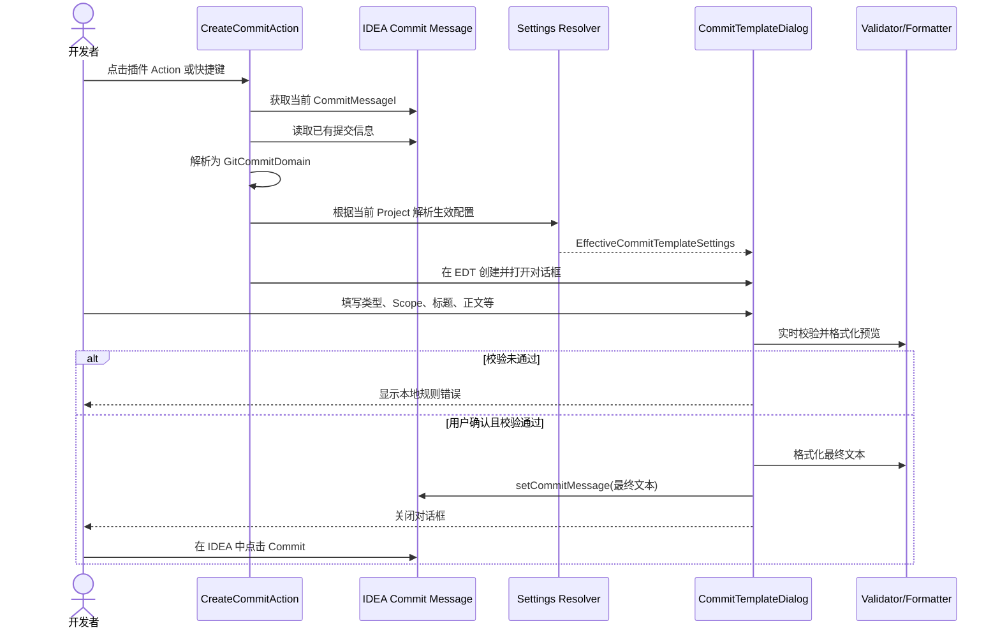
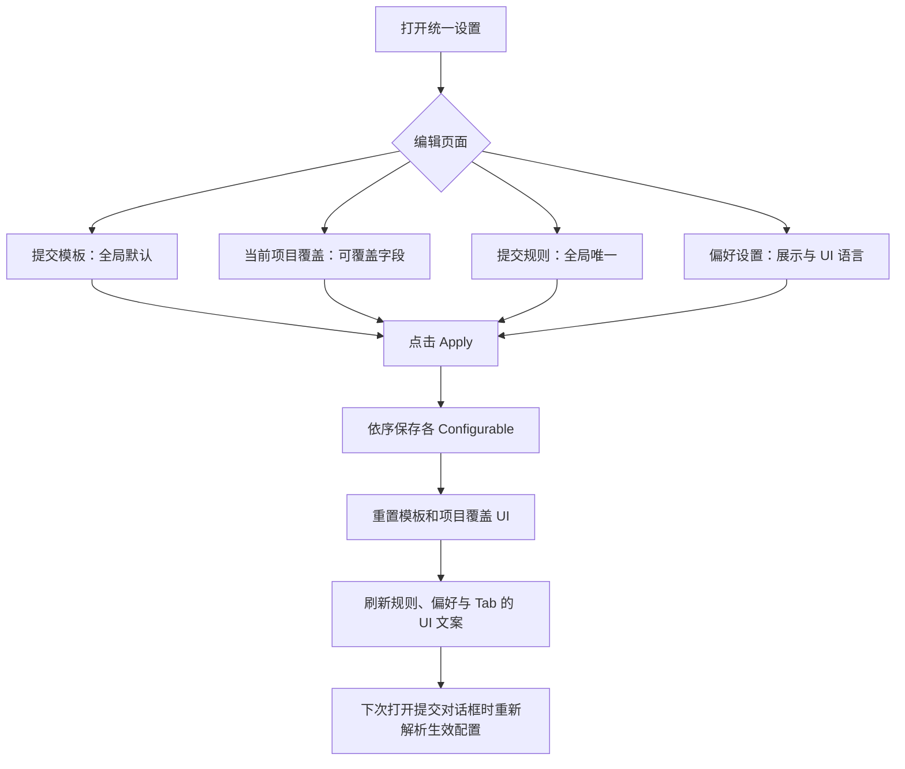

# Git Commit Assistant：执行流程

> 本文描述现有提交模板流程与设置流程的执行边界。AI 流程是规划，单独见 [`ai-design-proposal.md`](ai-design-proposal.md)。

## 1. 角色与责任

| 角色 | 责任 |
| --- | --- |
| 开发者 | 选择待提交变更、编辑提交字段、确认回填，并最终在 IDEA 中执行提交 |
| 插件 Action | 定位 IDEA 的 Commit Message 控件、当前项目和已有提交信息 |
| 提交模板对话框 | 展示结构化字段、预览、校验错误及确认/取消操作 |
| 配置解析器 | 合并全局默认和当前项目允许覆盖的字段，生成不可变的生效配置 |
| 领域层 | 校验提交字段并将其格式化为最终 Commit Message |
| IntelliJ Commit 工具窗口 | 持有 Commit Message；只有用户自己触发最终 Git commit |

## 2. 用户提交模板主流程（当前已实现）



### 2.1 关键步骤

1. `CreateCommitAction` 从 Action DataContext 获取 `CommitMessageI`；若已有文本，解析为 `GitCommitDomain` 用于回显。
2. 有 `Project` 时，`CommitTemplateSettingsResolver` 解析当前项目的 `EffectiveCommitTemplateSettings`。
3. `CommitTemplateDialog` 显示提交类型、Scope、标题、正文、Breaking Change、Issue 与 Skip CI 字段。
4. 若全局 `previewEnabled=true`，对话框创建预览区域；关闭时不创建预览区域。
5. 点击确认时，使用 `CommitMessageValidator` 按全局规则校验。
6. 校验通过后，使用 `CommitMessageFormatter` 生成文本，调用 `CommitMessageI#setCommitMessage` 回填。
7. 插件结束；用户在 IDEA 原生 Commit 流程中决定是否最终执行 Git commit。

### 2.2 明确不做的事情

- 不调用 Git CLI 或 Git4Idea 执行提交；
- 不自动添加、移除或修改 included changes；
- 不自动推送；
- 不在未确认的情况下覆盖 Commit Message；
- 不将提交内容发送至外部服务。

## 3. 设置生效流程（当前已实现）



### 3.1 配置解析算法

`CommitTemplateSettingsResolver#resolve()`：

| 字段 | 解析规则 |
| --- | --- |
| 提交内容语言 | 项目 `language` 非 null 则使用项目值，否则全局值 |
| 自定义模板开关 | 项目 `customEnable` 非 null 则使用项目值，否则全局值 |
| 自定义类型列表 | 项目显式配置列表则使用项目列表，否则全局列表 |
| 提交规则 | 始终使用全局值 |
| 预览 | 始终使用全局值 |
| Gitmoji 开关与位置 | 始终使用全局值 |
| 插件 UI 语言 | 由全局设置独立解析，且不属于项目覆盖 |

### 3.2 UI 语言刷新

1. 用户在“偏好设置 → 界面语言”选择同步 IDEA 或手工语言。
2. Apply 先保存偏好设置。
3. `PluginUiLanguageSettings` 依据同步状态解析语言；同步时读取 `DynamicBundle.getLocale()`。
4. 统一设置页刷新 Tab 标题、规则页与偏好页文案。
5. 新开启的提交模板对话框用该 UI 语言显示控件文本。

## 4. 设置变更的验收流程

### 4.1 全局/项目边界

1. 在项目 A 设置 Gitmoji、预览和规则，点击 Apply。
2. 打开项目 B 的同一设置页。
3. 验证项目 B 中的 Gitmoji、预览和规则与项目 A 一致，且“当前项目覆盖”无法编辑这些项。
4. 在项目 B 覆盖内容语言或自定义类型。
5. 验证仅项目 B 的提交对话框使用该覆盖；项目 A 不受影响。

### 4.2 提交消息

1. 在 Commit 工具窗口输入已有消息，打开插件，确认字段回显。
2. 开启必填 Scope 后，空 Scope 点击确认应被本地拦截。
3. 输入超出标题最大长度的 subject，应被本地拦截。
4. 关闭预览后重新打开对话框，不应出现预览区域。
5. 点击确认后，检查 IDEA Commit Message 已被回填；最终提交必须仍由用户点击 IDEA 的 Commit 完成。

## 5. 故障处理原则

| 场景 | 行为 |
| --- | --- |
| 无 Commit Message 控件 | 不尝试提交；Action 安全退出或显示可本地化提示 |
| 无 Project | 使用全局默认配置；不得读取项目覆盖 |
| 当前没有提交类型 | 显示前往设置的入口，不生成无效消息 |
| 校验失败 | 保留用户填写内容，仅显示错误 |
| 异步读取 Scope 历史失败 | 对话框保持可用；仅不补充历史 Scope |
| 设置 Apply 失败 | 保持未保存状态并提示具体字段错误；不写入部分无效规则 |

## 6. 后续 AI 与本流程的衔接

AI 仅作为对话框内的“生成候选内容”步骤插入：

```text
收集受控变更摘要 → 用户确认发送范围 → 生成候选 → 本地校验/格式化 → 预览差异 → 用户明确回填
```

它不会改变本流程的最后两项原则：**本地校验和格式化仍然由插件完成；最终 Git commit 始终由用户在 IDEA 中执行。**
