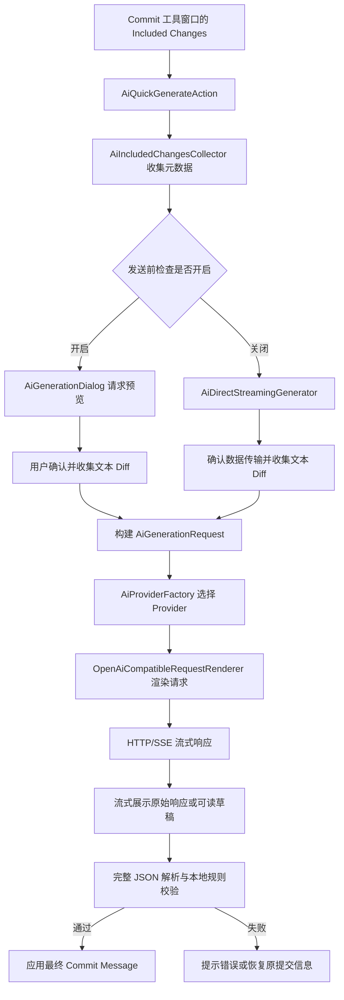

# Git Commit Template 插件说明文档

> 面向两类读者：
>
> - **普通插件使用者**：了解安装、提交模板配置、AI 提交建议和常见问题。
> - **项目开发者**：了解工程架构、开发环境、调试验证和扩展 AI Provider 的方式。

## 1. 项目简介

Git Commit Template 是一个 IntelliJ IDEA 插件，用于在 Git 提交前创建、格式化和校验结构化的 Commit Message，并提供基于当前待提交变更的 AI 提交信息建议。

项目在原 `MobileTribe/commit-template-idea-plugin` 的基础上继续维护和扩展。当前插件标识为 `commit-template-plugin`，名称为 **Git Commit Template**。

### 1.1 解决的问题

- 将团队提交信息统一为可读、可检索的结构化格式。
- 在 IDEA Commit 工具窗口内填写提交信息，避免手工拼接格式。
- 在提交前按配置规则检查提交信息，尽早发现格式问题。
- 基于当前 Commit UI 中已勾选的变更生成 AI 提交建议，降低撰写成本。
- 对 AI 请求内容、API Key 和最终输出增加本地安全控制。

### 1.2 提交信息格式

默认格式遵循 Conventional Commits 的常见写法：

```text
<type>(<scope>): <subject>

<body>

<footer>
```

其中 `scope` 可按项目配置设为可选。示例：

```text
feat(config): 添加通义千问生成参数配置

- 支持配置采样参数和思考模式
- 将供应商专属参数写入 AI 请求

Refs: #123
```

### 1.3 运行与开发基线

| 项目 | 当前配置 |
| --- | --- |
| IntelliJ Platform | IntelliJ IDEA Community（`IC`）2023.3 |
| 最低兼容 Build | `233` |
| Java | JDK 17 |
| Gradle Wrapper | Gradle 8.13 |
| IntelliJ Gradle Plugin | `org.jetbrains.intellij` 1.17.4 |
| Git 依赖 | `Git4Idea` |
| 插件版本 | 以 `gradle.properties` 的 `pluginVersion` 为准 |

实际可用范围仍取决于目标 IDE、已安装插件和运行环境；发布前应使用目标 IDEA 版本在 Sandbox 中回归验证。

---

# 第一部分：普通插件使用者

## 2. 安装与入口

### 2.1 安装插件

可通过以下方式安装：

1. 在 IDEA 打开 **Settings / Preferences → Plugins**。
2. 在 Marketplace 搜索 **Git Commit Template** 并安装；如使用本地构建包，可选择从磁盘安装插件 ZIP。
3. 重启 IDEA（若 IDE 提示需要）。

项目仓库和问题反馈入口：

- 仓库：<https://github.com/muzilib/commit-template-idea-plugin>
- Issues：<https://github.com/muzilib/commit-template-idea-plugin/issues>

### 2.2 打开插件设置

进入：

```text
Settings / Preferences → Tools → Commit Template Idea Plugin
```

设置页包含以下标签：

| 标签 | 用途 |
| --- | --- |
| Commit Template | 配置全局提交模板默认值 |
| Project Overrides | 对当前项目覆盖全局模板设置 |
| Commit Rules | 配置提交信息校验规则 |
| Preferences | 配置界面语言、外观等插件偏好 |
| AI Model | 配置 AI 提交建议服务 |
| About | 查看插件相关信息 |

### 2.3 常用操作入口

在 IDEA 的 Git Commit 工具窗口中可以使用：

- **创建提交模板**：打开结构化 Commit Message 编辑面板。
- **AI 生成提交信息**：根据当前 Included Changes 中勾选的变更生成建议。
- 快捷键：默认可通过 `Alt + Shift + Q` 调出提交模板面板；不同操作系统和 Keymap 可能存在冲突，请以 IDEA 实际快捷键配置为准。

## 3. 提交模板与本地规则

### 3.1 字段说明

| 字段 | 作用 | 示例 |
| --- | --- | --- |
| `type` | 本次变更的类别 | `feat`、`fix`、`docs` |
| `scope` | 影响的模块或范围，可配置为可选 | `config`、`vcs` |
| `subject` | 简洁说明本次改动 | `添加 AI 模型配置` |
| `body` | 补充实现背景和关键内容 | `- 支持 Qwen 专属参数` |
| `footer` | 关联 Issue、兼容性说明等 | `Refs: #123` |
| Breaking Change | 不兼容变更说明（如规则启用） | `BREAKING CHANGE: ...` |

### 3.2 推荐的提交类型

提交类型以设置页中实际允许的类型为准。常见约定如下：

| 类型 | 适用场景 |
| --- | --- |
| `feat` | 新功能 |
| `fix` | 缺陷修复 |
| `docs` | 文档更新 |
| `style` | 不影响逻辑的格式或样式调整 |
| `refactor` | 不新增功能、不修复缺陷的重构 |
| `perf` | 性能优化 |
| `test` | 测试变更 |
| `build` | 构建系统或依赖变更 |
| `ci` | CI/CD 配置变更 |
| `chore` | 其他维护性事务 |

### 3.3 配置规则的建议

在 **Commit Rules** 标签中，根据团队规范配置允许类型、标题长度、Scope 是否必填、正文或 Footer 的格式等规则。

建议：

- 团队首次接入时先采用少量稳定的 `type`，避免规则过于复杂。
- Subject 使用简洁动宾短语，不重复描述文件名。
- 多文件功能修改时，Body 应概括能力变化，而不是逐个罗列文件路径。
- 关联工作项时统一在 Footer 中填写，例如 `Refs: #123`。

本地规则用于校验提交信息质量；AI 返回的建议同样必须经过这些规则检查才能成为最终结果。

## 4. AI 提交建议

### 4.1 功能边界

AI 功能只负责生成 Commit Message 建议。它**不会**：

- 执行 `git commit`；
- 推送代码；
- 暂存或取消暂存文件；
- 修改项目代码；
- 替代用户完成最终审核。

生成结果始终应由开发者审阅，必要时手工修改后再提交。

### 4.2 支持的服务商

| 服务商 | 推荐兼容接口地址 |
| --- | --- |
| Qwen（通义千问） | `https://dashscope.aliyuncs.com/compatible-mode/v1/chat/completions` |
| ChatGPT / OpenAI | `https://api.openai.com/v1/chat/completions` |
| DeepSeek | `https://api.deepseek.com/chat/completions` |
| 自定义 | 用户提供的 OpenAI-Compatible Chat Completions 地址 |

模型名称由用户填写，应与所选服务商和账号权限匹配。预设地址可编辑，以适配代理、网关或兼容服务。

### 4.3 配置 AI 服务

进入 **Settings / Preferences → Tools → Commit Template Idea Plugin → AI Model**，按以下步骤设置：

1. 勾选 **启用 AI 提交建议**。
2. 选择模型供应商。
3. 确认或修改 API 地址。
4. 填写模型名称。
5. 点击设置 API Key，并输入对应服务商的密钥。
6. 按需要展开 **更多设置**，配置 Temperature、最大输出 Token、系统提示词和供应商专属选项。
7. 点击 **Apply** 或 **OK** 保存。

API Key 使用 IntelliJ Platform 的 **Password Safe** 保存，插件的普通配置文件不保存明文 API Key。每个供应商（Qwen、ChatGPT、DeepSeek、自定义）各自保存一份独立 Key；同一供应商切换 API 地址或模型时继续使用该供应商的 Key。

### 4.4 系统提示词

插件为 Qwen、ChatGPT、DeepSeek 和自定义服务分别提供默认系统提示词。默认提示词要求 AI 根据提交模板和 Diff 输出固定字段的 JSON，而不是直接返回不可控的自然语言。

可在 AI 设置中为当前供应商配置自定义系统提示词。优先级为：

```text
当前供应商自定义提示词
> 当前供应商的内置默认提示词
```

如果旧的自定义提示词无法获得新版本默认提示词的效果，可在系统提示词区域执行“恢复当前供应商默认提示词”，然后保存设置。

### 4.5 使用 AI 生成提交信息

1. 打开 IDEA 的 **Commit** 工具窗口。
2. 在 **Included Changes** 中勾选希望纳入本次提交的文件。
3. 点击 **AI 生成提交信息**。
4. 根据“发送前检查”的配置完成后续操作。
5. 审阅生成结果，必要时自行修改。
6. 使用 IDEA 原有提交操作完成 Git 提交。

#### 模式 A：开启“发送前检查”

此模式适合希望先完整审阅请求内容的场景：

```text
收集并筛选 Included Changes
→ 显示请求预览
→ 用户确认发送
→ 流式显示 AI 响应
→ 完整 JSON 与本地规则校验
→ 用户手工应用到 Commit Message
```

预览窗口会展示实际请求相关内容，包括目标 URL、脱敏后的 Headers、请求 JSON、最终系统提示词、提交模板上下文、筛选后的 Diff 和筛选统计。Authorization 信息不会以明文展示。

#### 模式 B：关闭“发送前检查”

此模式适合希望快速生成草稿的场景：

```text
收集并筛选 Included Changes
→ 直接发送流式请求
→ 实时回填人类可读的 Commit Message 草稿
→ 流结束后进行完整 JSON 与本地规则校验
```

流式过程中可看到标题、正文逐步出现；这只是草稿展示。只有流式响应结束后，插件才会对完整 JSON 进行严格解析并执行本地提交规则校验：

- **校验成功**：保留最终格式化后的 Commit Message。
- **JSON 非法、规则不通过、网络失败或取消**：恢复 AI 生成前的 Commit Message，并显示通知。

## 5. 数据安全与隐私

### 5.1 实际发送的数据

AI 请求仅使用当前 Commit UI 中 **Included Changes** 的变更。插件不会自动扫描并发送整个工作区的所有未提交文件。

在生成 Diff 前，插件会执行以下过滤：

- 排除二进制文件；
- 排除内置敏感文件名或路径特征，例如 `.env`、密钥文件、`credential`、`secret`、`password`、`token` 等；
- 排除符合用户配置的文件排除规则的路径；
- 仅发送相对于项目根目录的路径，避免传出本机绝对目录；
- 最多处理 100 个变更元数据文件；
- Diff 总长度最多 80,000 个字符；超过限制时停止继续追加；
- Diff 仅在内存中构建，不写入插件文件。

如果没有可发送的文本 Diff，插件会在联网前停止并提示没有符合条件的文件变更。

### 5.2 首次数据传输确认

首次真实发送 Diff 前，插件会要求确认数据传输授权。此确认与“发送前检查”开关无关：即使关闭预览模式，首次向远程 AI 服务发送内容时仍需授权。

请在确认前了解所选 API 地址对应的服务商、网络路径、数据留存和费用策略。不同 Provider 的隐私条款、配额、地域和计费由服务商决定，不由插件控制。

### 5.3 文件排除规则

可在 AI 设置中维护文件排除规则，用于禁止符合规则的文件发送到 AI。建议将团队中的私密配置、证书、生产环境配置、客户数据和生成目录加入排除规则。

内置过滤是基础保护，不能替代组织的数据分级和安全审查。包含敏感业务内容的代码是否可发送，仍应遵循团队和公司的安全制度。

## 6. Qwen 专属设置

选择 Qwen 后，在 **更多设置** 中可见其专属参数。未填写的可选数值不会发送，由服务端使用模型默认值。

| 类别 | 参数 | 说明 |
| --- | --- | --- |
| 流式统计 | `stream_options.include_usage` | 是否在流式响应中请求用量信息 |
| 采样 | `top_p`、`top_k` | 控制候选范围和随机性 |
| 惩罚 | `repetition_penalty`、`presence_penalty` | 调整重复倾向和新内容倾向 |
| 随机性 | `seed` | 在服务端支持时用于复现随机结果 |
| 思考 | `enable_thinking`、`thinking_budget`、`reasoning_effort` | 控制思考模式和预算 |
| 搜索 | `enable_search`、`forced_search`、`search_strategy` | 控制联网检索行为 |
| 数据检查 | `X-DashScope-DataInspection` | 启用内容数据检查 Header |

注意事项：

- `thinking_budget` 与 `reasoning_effort` 不应同时填写，设置页会阻止这种冲突配置。
- 未开启思考时，思考预算和推理强度不可用。
- 未开启联网搜索时，强制搜索和搜索策略不可用。
- 插件默认会显式发送 `enable_thinking: false`，避免部分 Qwen 思考模型将较小的输出 Token 预算全部用于推理内容，导致没有可见的 Commit Message 文本。
- 开启思考模式后，若出现“模型未返回可见文本”，可先关闭思考模式，或提高最大输出 Token 后重试。

## 7. 常见问题

### 7.1 找不到 AI 生成入口

确认：

- 插件已启用；
- 当前打开的是支持 Git 提交的项目；
- 位于 IDEA 的 Commit 工具窗口；
- AI 设置中已勾选“启用 AI 提交建议”。

### 7.2 提示没有可发送的文件变更

可能原因：

- Included Changes 中没有勾选文件；
- 文件是二进制文件；
- 文件命中内置敏感规则；
- 文件命中用户排除规则；
- 无法从当前变更生成文本 Diff。

检查 Included Changes 和排除规则，并确认待提交内容确实为文本变更。

### 7.3 API Key 已配置但仍鉴权失败

检查：

- API Key 是否属于当前服务商和模型；
- API 地址是否正确，包括是否使用了正确的 `/chat/completions` 路径；
- 当前网络、代理或公司网关是否可访问服务端；
- 当前供应商是否已配置对应的 Key；
- 服务商账号是否有模型访问权限和可用额度。

### 7.4 AI 返回内容无法应用

AI 输出必须是完整、合法并符合当前提交规则的 JSON。若模型返回额外说明、字段缺失、类型不允许或格式不符合规则，插件会拒绝应用或在直连模式中恢复之前的提交信息。

可尝试：

- 检查或恢复当前供应商的默认系统提示词；
- 调低 Temperature；
- 提高最大输出 Token；
- 检查提交规则是否过于严格；
- 确认模型支持流式 Chat Completions 接口。

### 7.5 Qwen 没有可见输出

思考模型可能先返回推理内容，且最大输出 Token 可能包含推理和最终答案。关闭思考模式，或增大最大输出 Token 后重试。

### 7.6 自定义提示词似乎未更新

自定义系统提示词优先于内置默认提示词。若此前保存过旧版本提示词，需要在 AI 设置中恢复当前供应商默认提示词，并点击 Apply。

---

# 第二部分：项目开发者

## 8. 工程结构与架构

### 8.1 技术栈与依赖

项目使用 Java 17 和 IntelliJ Platform Gradle Plugin 构建 IntelliJ IDEA 插件。主要依赖包括：

| 依赖 | 用途 |
| --- | --- |
| IntelliJ Platform SDK | 插件扩展点、VCS/Commit UI、设置页、通知和 Password Safe |
| Git4Idea | Git 集成能力 |
| Jackson Databind | AI 请求和 SSE 响应 JSON 处理 |
| Apache HttpClient | OpenAI-Compatible HTTP 请求与流式响应 |
| Lombok | 部分配置和领域对象的样板代码生成 |
| JUnit Jupiter | 单元测试基础设施 |

### 8.2 目录说明

```text
src/main/java/com/c301/plugin/
├── application/       # 应用层编排代码
├── config/            # 设置页、Action、持久化状态、规则解析
├── constant/          # 常量定义
├── domain/            # AI 与提交信息领域模型、规则和接口
├── infrastructure/    # Provider、请求渲染、凭证存储、路径匹配
├── model/             # 兼容既有业务的数据模型
├── platform/          # IntelliJ Platform / VCS 适配
├── ui/                # Swing 对话框、流式草稿、通知
└── utils/             # 通用工具与国际化工具

src/main/resources/
├── META-INF/plugin.xml     # 插件元数据、服务、扩展点和 Action 注册
├── i18n/                   # 多语言 properties 资源
├── icons/                  # 插件与操作图标
├── ai-system-prompt.toml   # AI 默认系统提示词模板
└── version.properties      # 构建时生成的版本信息

docs/                      # 项目文档
static/                    # README 等文档使用的静态图片
```

### 8.3 插件注册

`src/main/resources/META-INF/plugin.xml` 是插件的注册入口，主要包含：

- 插件 ID、名称、版本、Vendor 信息与 IDEA 兼容范围；
- `com.intellij.modules.platform`、`com.intellij.modules.vcs` 与 `Git4Idea` 依赖；
- 应用级和项目级服务；
- 设置页 `UnifiedCommitTemplateSettingsConfigurable`；
- VCS Log 的 Gitmoji 自定义列；
- Commit 工具窗口中的模板 Action 和 AI Action。

任何新增 Action、服务或扩展点都应先确认 IntelliJ Platform API 的兼容范围，再在该文件中注册。

### 8.4 核心模块职责

| 模块 | 关键类/文件 | 职责 |
| --- | --- | --- |
| 统一设置 | `UnifiedCommitTemplateSettingsConfigurable` | 组织全局模板、项目覆盖、规则、偏好、AI 和 About 标签 |
| 提交模板 | `CreateCommitAction`、`CommitTemplateDialog` | 打开并回填结构化提交信息 |
| 提交规则 | `CommitMessageRulesConfigurable`、`domain/commit` | 配置与校验 Commit Message |
| AI 偏好 | `AiPreferencesState`、`AiPreferencesConfigurable` | 保存非敏感 AI 配置并提供设置界面 |
| Provider | `AiProvider`、`AiProviderFactory`、`*AiProvider` | 按供应商生成 OpenAI-Compatible 请求并处理流式响应 |
| 请求渲染 | `OpenAiCompatibleRequestRenderer` | 生成预览和真实发送共用的请求 Payload |
| 凭证 | `PasswordSafeAiCredentialStore` | 使用 Password Safe 保存 API Key |
| Diff 收集 | `AiIncludedChangesCollector` | 只读取 Included Changes 并执行路径、二进制和容量过滤 |
| AI UI | `AiGenerationDialog`、`AiDirectStreamingGenerator` | 预览模式与直连流式模式的交互编排 |
| 增量草稿 | `IncrementalSuggestionDraft` | 将未完成 JSON 中可识别的字段渲染为可读草稿 |
| 默认 Prompt | `ai-system-prompt.toml`、`AiSystemPromptTemplates` | 加载通用和供应商专属系统提示词 |

## 9. AI 生成调用链

### 9.1 请求数据模型

`AiGenerationRequest` 表示已经通过本地安全策略、允许发送给服务商的请求数据，包含：

- API 地址和模型名；
- 最终系统提示词；
- Temperature 与最大输出 Token；
- Qwen 专属选项；
- 生成语言、允许的 Commit 类型和提交规则；
- 提交模板上下文；
- 经过筛选的 Diff。

API Key 不属于该请求模型，也不应写入普通持久化状态或日志。

### 9.2 调用流程



### 9.3 请求预览与真实请求一致性

请求预览和真实 HTTP 请求必须复用 `OpenAiCompatibleRequestRenderer`，再由当前 `AiProvider` 追加专属 Payload 或 Header。这样可以避免“预览内容”和“实际发送内容”不一致。

Provider 的扩展点包括：

```java
default void customizeRequestPayload(Map<String, Object> payload, AiGenerationRequest request)
default void customizeRequestHeaders(HttpPost post, AiGenerationRequest request)
```

Qwen 使用该机制将通用 `max_tokens` 替换为 `max_completion_tokens`，并加入 `enable_thinking`、搜索参数、`stream_options` 或数据检查 Header 等专属内容。

### 9.4 AI 输出约束

默认 Prompt 要求输出固定六字段 JSON。示例：

```json
{
  "type": "feat",
  "scope": "config",
  "subject": "添加通义千问生成参数配置",
  "body": "- 支持采样参数和思考模式配置",
  "breakingChange": "",
  "footer": ""
}
```

流式阶段允许将已识别的字段渲染为草稿；但最终结果必须在响应结束后由 `AiSuggestionParser` 和提交规则校验器进行完整、严格的解析与校验。

## 10. 开发环境与本地运行

### 10.1 环境准备

1. 安装 JDK 17。
2. 使用 IntelliJ IDEA 打开项目根目录。
3. 让 IDEA 按 `build.gradle` 和 `gradle.properties` 导入 Gradle 项目。
4. 确认 Project SDK 与 Gradle JVM 均为 JDK 17。
5. 等待 IDE 索引、依赖下载和 IntelliJ Platform SDK 初始化完成。

构建配置中的目标平台为 `IC-2023.3`，并依赖 `Git4Idea`。如果修改目标平台版本，应同时检查 `plugin.xml` 中的兼容声明及所使用 API 是否仍可用。

### 10.2 在 Sandbox 中运行插件

推荐使用 IntelliJ Gradle Plugin 生成的 Run IDE 配置启动 Sandbox IDEA：

1. 在 IDEA 的 Gradle 工具窗口找到项目任务。
2. 运行 IntelliJ Platform 的 `runIde` 任务，或使用 IDE 自动创建的等价运行配置。
3. 等待 Sandbox IDEA 启动。
4. 在 Sandbox 中打开一个 Git 项目，进入 Commit 工具窗口验证模板和 AI 功能。

Sandbox 与日常 IDEA 的配置、缓存和 Password Safe 数据可能彼此独立。测试 AI 时需要在 Sandbox 内重新填写 API Key，并使用可控的测试仓库和测试密钥。

### 10.3 常用 Gradle 任务

| 任务 | 用途 |
| --- | --- |
| `runIde` | 启动带插件的 Sandbox IDEA |
| `test` | 运行 JUnit 测试 |
| `buildPlugin` | 构建可安装的插件 ZIP |
| `buildStable` | 清理后构建 Stable 渠道包 |
| `buildAlpha` | 清理后构建 Alpha 渠道包 |

构建包命名包含插件版本、渠道和构建时间。执行构建或发布前，请结合团队的 JDK、网络仓库和目标 IDEA 版本要求确认环境。

### 10.4 调试建议

- 对 Action、设置页和 Provider 调用链设置断点，优先在 Sandbox 验证。
- AI 网络问题优先检查 HTTP 状态码、SSE 原始事件结构和服务商文档，不要记录 API Key 或完整敏感 Diff。
- Commit UI 集成问题需确认 `DataContext` 是否提供 `CommitMessageI` 和 Commit workflow handler。
- 流式回填 UI 必须切回 Swing 事件线程，例如使用 `invokeLater`，避免后台线程直接改写 UI。

## 11. 开发流程与编码约束

### 11.1 推荐开发流程

```text
明确需求与安全边界
→ 定位现有模块和调用链
→ 设计最小变更
→ 实现领域模型、基础设施和 UI
→ 补充 i18n、默认 Prompt 或文档
→ 运行静态检查和针对性测试
→ 在 Sandbox 中手工回归
→ 审阅 Diff 后提交
```

### 11.2 代码变更原则

- 优先修复根因，避免只在 UI 层掩盖问题。
- 保持修改小而聚焦，遵循现有的包结构和命名方式。
- 不在普通持久化配置、日志、异常文本中写入 API Key。
- 不应将原始敏感 Diff 落盘。
- AI 只能生成建议，不能在代码中隐式执行提交、推送、暂存或代码修改。
- 新增用户可见文本必须同步加入全部支持语言的 i18n 资源。
- 变更请求渲染时，同时验证预览和真实请求。

### 11.3 GUI Designer 约束

以下方法由 IDEA GUI Designer 自动生成，**禁止手工修改**：

```java
CommitTemplateDialog.$$$setupUI$$$()
CommitTemplateSettingUI.$$$setupUI$$$()
```

若需要扩展现有表单，应在运行时通过普通 Swing 组件和布局完成，避免破坏 `.form` 文件与生成代码的一致性。

### 11.4 国际化

国际化资源位于：

```text
src/main/resources/i18n/
```

当前包含默认资源和英文、简体中文、繁体中文、德语、加拿大法语、法语、意大利语、日语、韩语等语言文件。新增 key 时应：

1. 在默认 `data.properties` 添加 key；
2. 在所有语言包添加对应 key；
3. 确保 properties 多行文本使用 `\n`，不要直接拆成新的物理行；
4. 在切换 UI 语言后验证设置页标题、通知和对话框文本。

### 11.5 静态检查与验证

每次修改后建议按从小到大的范围验证：

1. 使用 IDEA Diagnostics 检查变更 Java 文件。
2. 对 Java、资源和文档执行格式与空白检查：

   ```sh
   git diff --check
   ```

3. 修改 i18n 后检查所有语言包的 key 是否齐全。
4. 涉及 Commit UI 或 AI 网络流程时，在 Sandbox 中手工验证。
5. 条件允许时执行单元测试、插件构建和目标 IDEA 版本兼容性回归。

不要为了通过检查而覆盖、重置或删除与当前任务无关的未提交改动。

## 12. 如何扩展新的 AI Provider

新增 Provider 时，应保持现有 OpenAI-Compatible 分层：共用 HTTP/SSE 传输层，供应商差异放在 Provider 实现中。

### 12.1 实施步骤

1. 在 `domain/ai/AiProviderType` 中增加供应商枚举项：默认 API 地址、Prompt 模板名和模型输入提示 key。
2. 新增 Provider 类，必要时继承或复用 `OpenAiCompatibleProvider`。
3. 在 `infrastructure/ai/AiProviderFactory` 中注册该 Provider。
4. 在 `AiPreferencesConfigurable` 中补充供应商选择、默认地址和专属参数 UI。
5. 在 `AiPreferencesState` 增加非敏感持久化字段；API Key 仍必须经 `AiCredentialStore` 保存到 Password Safe。
6. 若有专属请求字段或 Header，通过 `customizeRequestPayload`、`customizeRequestHeaders` 实现。
7. 在 `ai-system-prompt.toml` 添加默认系统提示词，并确保枚举中的模板名可被加载。
8. 补齐全部 i18n 文案。
9. 验证请求预览与真实发送得到同一份 Payload/Header。
10. 在 Sandbox 中验证鉴权、流式 SSE、错误处理、非法输出和规则校验。

### 12.2 扩展检查清单

- [ ] API 地址可编辑，预设切换行为正确。
- [ ] API Key 按供应商独立存储，切换地址或模型时不会与其他供应商共用。
- [ ] 未配置或无可发送 Diff 时不会发起网络请求。
- [ ] Provider 专属字段不会污染其他 Provider。
- [ ] 流式解析能处理该服务商的 SSE 数据格式。
- [ ] 完整输出仍需通过统一 JSON 解析和本地提交规则校验。
- [ ] 网络错误、取消和校验失败不会破坏原 Commit Message。

## 13. 发布与维护建议

### 13.1 发布前检查

- 校验 `plugin.xml` 的插件版本、兼容范围和依赖声明。
- 确认 `gradle.properties` 的 `pluginVersion`、`platformVersion`、`platformType` 正确。
- 在目标 IDEA 版本启动 Sandbox 并验证核心提交流程。
- 运行测试、构建插件 ZIP，并使用干净环境安装验证。
- 检查许可证、README、变更说明和本说明文档是否同步。
- 确认仓库、构建产物、日志和截图中不含 API Key 或敏感 Diff。

### 13.2 建议的回归场景

| 场景 | 预期结果 |
| --- | --- |
| 普通模板提交 | 模板能正确格式化并回填 Commit Message |
| 项目级覆盖 | 当前项目按覆盖配置工作，不影响全局默认值 |
| 无 Included Changes | AI 不联网并给出提示 |
| 敏感或二进制文件 | 文件不进入发送 Diff |
| 发送前检查开启 | 可审阅完整真实请求，再确认生成 |
| 发送前检查关闭 | Commit Message 流式展示草稿，结束后再最终校验 |
| 非法 AI JSON | 不应用最终结果；直连模式恢复原消息 |
| 规则不匹配 | 拒绝 AI 结果或恢复原消息 |
| Qwen 思考关闭 | 请求明确携带 `enable_thinking: false` |
| 多语言界面 | 新增文案在全部资源包中可用 |

## 14. 许可与反馈

项目使用 Apache License 2.0。许可证全文见仓库根目录的 `LICENSE` 文件。

如发现问题或有功能建议，请在项目 Issues 中提供：

- IDEA 和插件版本；
- 操作系统；
- 可复现步骤；
- 脱敏后的错误信息或日志；
- 使用的服务商、模型及接口兼容情况（不要提交 API Key 或敏感 Diff）。
